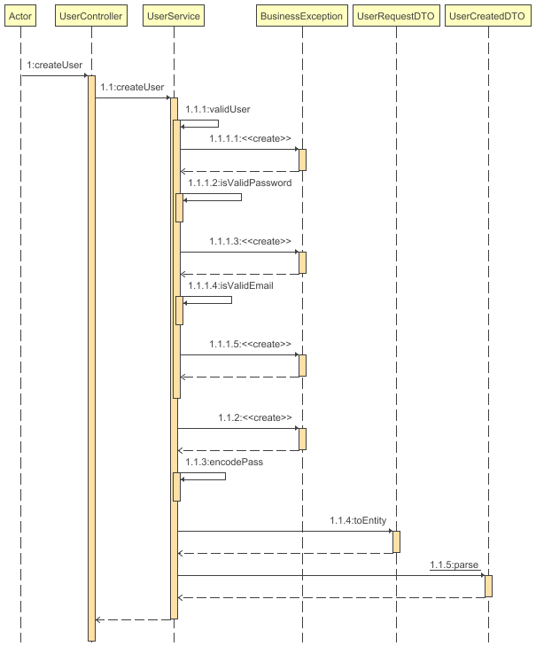

# Examen Nisum by Omar Berroterán
Aplicación demo para registro de usuarios.

# Stack de tecnología
- Java version: 17+
- Gradle Kotlin
- Spring Boot version: 3.1.1
- SprinSecurity, JWT, Hibernate, JPA, SpringDATA
- Patrones: Repository, MMVC
- H2 Dabatase
- DockerFile (Optional)

### Documentacion automatica con  Swagger
http://localhost:8080/api/v1/swagger-ui/index.html#/

### Consola de Base de datos/Persistence H2

http://localhost:8080/api/v1/h2-console/login.jsp

` URL JDBC: jdbc:h2:mem:test;

` clave: password

### Datos de Prueba:
user: juan@rodriguez.org

Patron de correo:  el email debe terminar en CL segun instrucciones.

## Historia de usuario

Desarrolle una aplicación que exponga una API RESTful de creación de usuarios. Todos los endpoints deben aceptar y retornar solamente JSON, inclusive al para los mensajes de error. Todos los mensajes deben seguir el formato: {"mensaje" : "mensaje de error"}

# Criterios de aceptación
- Banco de datos en memoria, como HSQLDB o H2.
- Proceso de build via Gradle.
- Persistencia con Hibernate.
- Framework Spring.
- Servidor Tomcat o Jetty Embedded
- Java 8+
- Entrega en un repositorio público (github o bitbucket) con el código fuente y script de creación de BD.
- Entrega diagrama de la solución.
- Todos los mensajes deben seguir el formato:
  {"mensaje": "mensaje de error"}
- El correo debe seguir una expresión regular para validar que formato sea el correcto.
  (aaaaaaa@dominio.cl

## Opcional
- JWT cómo token
- Pruebas de unidad
- Swagger/OpenAPI

## Gradle Ejecución
` gradle bootRun`

## Docker Ejecución
` ./docker run -p 8080:8080 my-spring-boot-app`

## Dashboard de las pruebas.
[Dasboard local. (si Gradle run previamente.)](file:///./build/reports/tests/test/index.html)

## Postman JSON
https://api.postman.com/collections/25706750-188e9732-29b1-477a-b4fe-dff064afae02?access_key=PMAT-01H9R6M8A03ZZDKPT9EH4J4WET

[--> Archivo local ](./nisum.postman_collection.json)

## Diagrama de secuencia
#### 1. Iniciar Sesion

#### 2. Crear un usuario.

# EOF